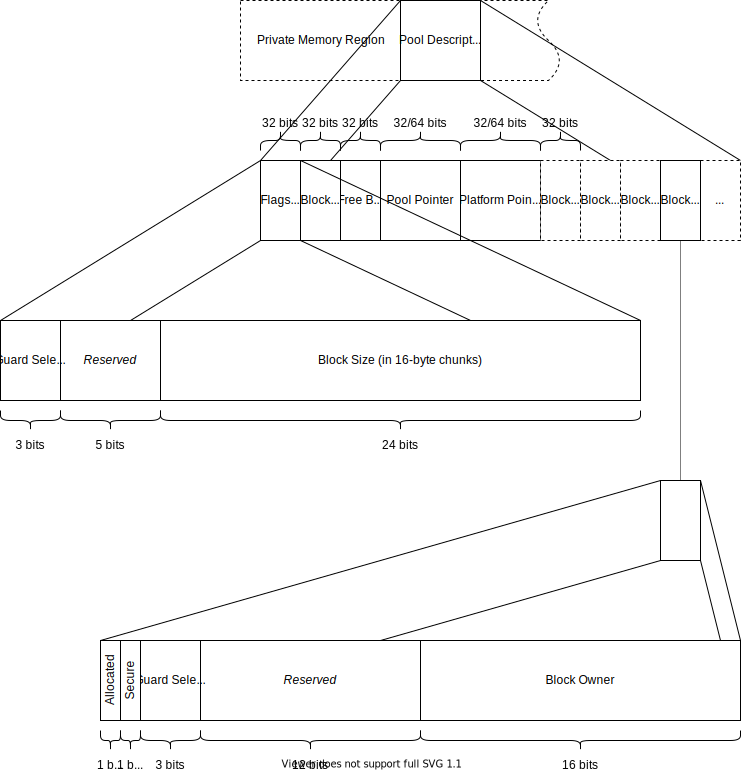
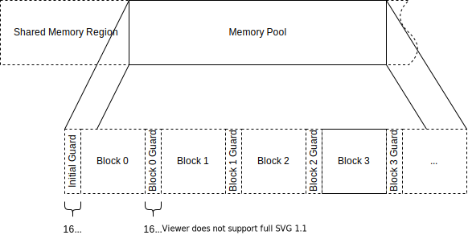

..  S-Pool design document.
    Copyright: 2021 Andrew MacIsaac
    SPDX-License-Identifier: MPL-2.0

Design
======

Pool Memory Structure
---------------------

Each pool is composed of two distinct parts: the pool descriptor which contains all of the metadata
concerning the state of the pool, and the pool body which contains the actual allocated and free
blocks.

All words are considered to be 32 bits in size.

.. _pool-descriptor:

Pool Descriptor
^^^^^^^^^^^^^^^

The pool descriptor is typically located in a private memory region accessible only to the owner of
the memory pool.

    Representation of memory pool descriptor.

The first word of the pool descriptor contains space for eight bits of status flags followed by a
24-bit block size.  Currently only one 3-bit field is used, to indicate if :ref:`guard-bytes` are in
use for the pool and what guard pattern is used by the initial guard bytes.  Any non-zero value
indicates guard bytes are in use.  The block size is an unsigned value indicating the number of
16-byte segments which make up an allocatable block from the pool (exclusive of guard bytes).

.. important:: All pool items are a multiple of 16 bytes in size.
    Enabling :ref:`guard-bytes` adds an additional 16-byte segment to the block size, to make space
    for the guard bytes.

The second word of the pool descriptor is the size of the pool in blocks.

The third word of the descriptor is the number of blocks in the pool which are still free.

The fourth field of the descriptor is a pointer to the start of the pool body in shared memory.  As
such, it may be 32 or 64 bits in size, depending on the pointer size of the platform.

The fifth field is another pointer, this time pointing to arbitrary platform-specific implementation
data.

.. _block-state-words:

Block State Words
"""""""""""""""""

Following the fixed descriptor words is an array of block state words, one per block in the pool.
Each word contains a 16-bit status field and a 16-bit block owner index.

The first status bit indicates whether or not the block is currently allocated.  The second
indicates whether the contents of the allocated block are to be considered "secure."  When a secure
block is released, its contents are automatically overwritten with random data to ensure it cannot
later be leaked.

The block owner value is used to indicate which application currently has exclusive read/write
access to the block.  If possible, this ownership will be enforced with platform-specific
permissions mechanisms.

Pool Data
^^^^^^^^^

The data region of the pool is typically located in a shared memory region.

    Representation of memory pool data.

The data region contains the blocks which are available for allocation by users of the S-Pool API.
The allocation and ownership states of the blocks are tracked by the relevant fields in the
:ref:`block-state-words`.

.. _guard-bytes:

Guard Bytes
"""""""""""

If guard bytes are turned on for a pool (the "Guard Selection" field is non-zero in the
:ref:`pool-descriptor`), then an extra 16-byte buffer will be allotted at the end of each block.
This buffer will be filled with a specific pattern, and when a block is freed, the guard bytes
before and after it will be examined to determine if overruns or modifications have occurred.  If
the guards were modified then a configurable action will be taken.  While this is not guaranteed to
detect all buffer overruns, it can help significantly (at the expense of extra RAM usage).

The guard pattern used for each block is selected by the specific value of the guard selection
field.  An array of eight possible guard patterns is generated randomly when the pool is
initialized, and the guard selection is used as an index into that array.  The guard selection is
randomized each time a block is allocated, if the neighbouring block is also free (both adjoining
blocks must be free to change the value of a guard region).  The initial guard pattern (the region
before the first block in the pool) is restricted to the top seven of these patterns, since zero is
used to indicate no guard bytes.  The initial guard value is not changed for the lifetime of the
pool.
